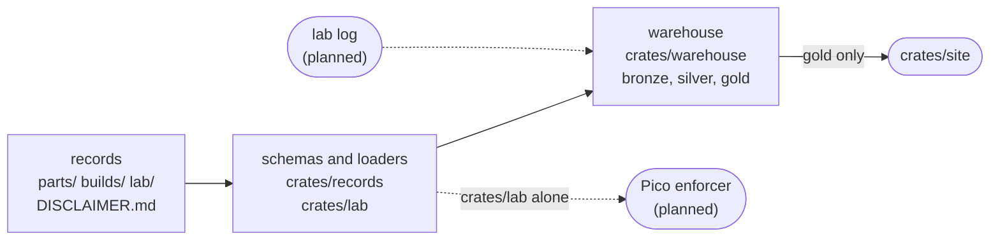

# Architecture

How Tentzhen's records, code and checks fit together, the rules that keep them honest, and the
plan for what comes next. Every rule below names what holds it, and a rule nothing holds says so:
the same grading `verification.md` asks of any claim.

## Layers



| layer | where | what it is |
|---|---|---|
| records | `parts/`, `builds/`, `lab/`, `DISCLAIMER.md` | The system of record. Everything else is rebuilt from these. |
| schemas and loaders | `crates/records`, `crates/lab` | Typed schemas that refuse what they don't know, and the checks the records' own rules call for. |
| warehouse | `crates/warehouse`, described in `docs/data-catalogue.md` | Bronze holds each file as read, silver holds typed rows the database constrains, and gold holds views that answer questions. It can be deleted at any time. |
| readers | `crates/site` today | They read gold. The Pico enforcer is to read the limits through `crates/lab` alone, so the safety path never depends on the database. |

## Rules

| rule | held by |
|---|---|
| Schema first: every file in `parts/`, `builds/` and `lab/` is loaded into the warehouse, or CI fails. A record is parsed by its schema on the way in; a drawing is kept as it is. A folder's README is not a record. | `every_file_in_the_records_folders_is_loaded` |
| Every schema refuses a key it doesn't know. | `every_table_refuses_a_key_it_does_not_know`, in `crates/records` and in `crates/lab` |
| A rule a record states in a comment is a check or a test. | the tests in `crates/lab`, for `lab/limits.toml`. Nothing holds this for new files: `unknown`. |
| Every file the warehouse loads is in bronze with its sha256, and every silver row traces to one. | `every_row_traces_to_the_bytes_it_came_from`, for the four silver tables with a `record` column; the rest reference one of those by foreign key. |
| A grade comes from its referents, never typed. | `grades_derive_from_referents`, `every_limit_gets_the_weakest_grade_of_its_facts`. One exception: a build claim's `sim` grade is typed beside its referent, and nothing checks that the referent earns it. |
| Readers of the warehouse read gold only. | `the_site_reads_only_gold`; the site is the only one so far. |
| Every table and view says what it is, and the catalogue is generated. | `every_table_and_view_says_what_it_is`, `the_catalogue_is_current` |
| The lab crate needs only serde and toml. | `the_lab_crate_needs_only_serde_and_toml` |
| Parsing records needs no database. | `parsing_records_needs_no_database` |
| Every dependency is pinned to one version. | `every_dependency_is_pinned`, for each crate's own; the rest by `Cargo.lock`, which CI builds with `--locked`; the compiler by `rust-toolchain.toml`. The workflow's actions are pinned by commit, and nothing checks that: `unknown`. |
| What is generated is what its generator writes: build pages, mural SVGs, the catalogue. The site's images are `brand/`'s files, byte for byte. | the Quality Gate's steps, and `the_catalogue_is_current` |
| A published build version never changes. | the Quality Gate's step of that name |
| `main` changes only through a PR that passes the Quality Gate. | the `main-protection` ruleset on GitHub |

The tests that span crates live in `crates/repo`. One of them holds this doc to the code: every
test and path it names up to the proposal below must exist.

## What the introspection shows

- **Two claim models, and parts have neither.** A build's `[[claim]]` has a typed `sim` grade with
  its referent and an `irl` record; it lands in `silver.claim` and `silver.referent`, graded by
  `gold.claim_grades`. The lab's `[fact.*]` has `trusted` or `record`; it lands in `silver.lab_fact`,
  graded by `gold.lab_fact_grades`.
- **Nothing can point at a claim.** Build claims are numbered by position (`claim_no`), and lab
  facts are named only inside `lab/limits.toml`.
- **The trusted base is prose.** A `trusted` referent is matched against the start of a bullet in
  `verification.md` by the test `every_trusted_fact_names_an_entry_in_the_trusted_base`, and build
  claims have no way to cite it.
- **`record` referents resolve to nothing.** Build claims and lab facts can name a measurement
  record, but no format or store for records exists yet. That's the lab log in `roadmap.md`,
  Phase 0.
- **Facts sit away from their parts.** The DPS5005's facts are in `lab/limits.toml`, and the
  DPS5005 has no part record. The Pico ceiling rests on no fact at all (`gold.limit_grades`).
- **Three gold views have no reader:** `grade_coverage`, `where_used` and `limit_grades`
  (`docs/data-catalogue.md`).
- **`main`'s Quality Gate did not run for the merge of #18,** for an unknown cause. The tree was
  the one the PR's run had passed, and the run for #19's merge covered it. The workflow can now be
  started by hand (`workflow_dispatch`).

## Proposal: one claim model

Every graded statement becomes a claim on its subject, in one shape:

```toml
[[claim]]
id = "input-range"
says = "Needs an input of 6-55 V, and at least 1.1 x its output"
trusted = "dps5005"        # an entry in the trusted base
# or any of: test = "...", check = "...", proof = "...", record = "..."
```

- **Claims live on their subject:** `parts/<part>.toml`, or `builds/<build>/v<n>.toml` as now. Each
  is cited as `<subject>#<id>`, for example `DPS5005#input-range`.
- **The grade comes only from which referents are present.** `proof`, `check` and `test` give
  proven, checked and tested; `record` gives measured; `trusted` gives trusted. There is no `grade`
  field.
- **The trusted base becomes data.** Its entries get ids, so a `trusted` referent is a key, not a
  prefix of a bullet.
- **The warehouse gets one model.** `silver.claim` and `silver.referent` cover every subject, with
  one `gold.claim_grades`, and `gold.limit_grades` reads claims.
- **The lab cites claims.** `lab/limits.toml`'s `rests_on` names claims
  (`rests_on = ["DPS5005#input-range"]`), and its `[fact.*]` tables go away.

Open questions, each with my recommendation:
1. **Numbers a rule reads, like the DPS5005's 6, 55 and 1.1.** Recommend a claim-level `values`
   table whose keys carry their unit (`min_volts`), checked by the rule that reads them.
2. **The bench supply.** Recommend a part record (`kind = "product"`), described by requirement
   like the site's other upstream components.
3. **Two axes or one.** Recommend keeping the sim axis (tested, checked, proven) and the bench axis
   (trusted, measured) apart, as `gold.claim_grades` does now. A limit's weakest grade is taken on
   the bench axis.

## Plan

Each step is one PR, done when its check passes:

1. **One claim model** in `crates/records` and the warehouse, with `debug-probe`'s claims migrated.
   Done when `gold.claim_grades` covers parts and builds, and no record can type a grade.
2. **The trusted base as data.** Done when every `trusted` referent is a foreign key.
3. **Lab facts become claims on parts:** `parts/dps5005.toml`, and a bench supply record. Done
   when `lab/limits.toml` has no `[fact.*]` and `gold.limit_grades` gives the same grades as
   before.
4. **A fact under the Pico ceiling:** the RP2350's rated I/O supply range, as a claim on
   `parts/rp2350.toml`. Done when `pico_3v3.max_volts` rests on it.
5. **Measurement records** with the lab log (`roadmap.md`, Phase 0). Done when a `record` referent
   is a foreign key.
