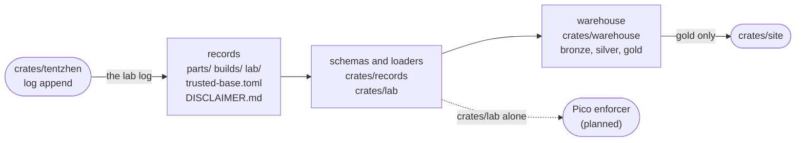

# Architecture

How Tentzhen's records, code and checks fit together, the rules that keep them honest, and the
plan for what comes next. Every rule below names what holds it, and a rule nothing holds says so:
the same grading `verification.md` asks of any claim.

## Layers



| layer | where | what it is |
|---|---|---|
| records | `parts/`, `builds/`, `lab/`, `trusted-base.toml`, `DISCLAIMER.md` | The system of record. Everything else is rebuilt from these. |
| schemas and loaders | `crates/records`, `crates/lab` | Typed schemas that refuse what they don't know, and the checks the records' own rules call for. |
| warehouse | `crates/warehouse`, described in `docs/data-catalogue.md` | Bronze holds each file as read, silver holds typed rows the database constrains, and gold holds views that answer questions. It can be deleted at any time. |
| readers | `crates/site` today | They read gold. The Pico enforcer is to read the limits through `crates/lab` alone, so the safety path never depends on the database. |
| host tools | `crates/tentzhen` | Commands for the bench. `tentzhen log append` writes an entry to the lab log through `crates/records`, chained to the entry before it. |

## Rules

| rule | held by |
|---|---|
| Schema first: every file in `parts/`, `builds/` and `lab/` is loaded into the warehouse, and so are `trusted-base.toml` and `DISCLAIMER.md`, or CI fails. A record is parsed by its schema on the way in; a drawing is kept as it is. A folder's README is not a record. | `every_file_in_the_records_folders_is_loaded` |
| Every schema refuses a key it doesn't know. | `every_table_refuses_a_key_it_does_not_know`, in `crates/records` and in `crates/lab`; for the lab log, the measurement records and the lab-target list, `a_log_entry_keeps_its_shape`, `a_measurement_record_keeps_its_shape` and `a_lab_target_keeps_its_shape` |
| A rule a record states in a comment is a check or a test. | the tests in `crates/lab` and `crates/records`, for `lab/limits.toml`, and for `lab/targets.toml`, whose comment lists what nothing holds. Nothing holds this for new files: `unknown`. |
| Every file the warehouse loads is in bronze with its sha256, and every silver row traces to one. | `every_row_traces_to_the_bytes_it_came_from`, for the seven silver tables with a `record` column; the rest reference one of those by foreign key, directly or through another table. |
| Each lab-log entry names the sha256 of the line before it, so an entry edited, dropped or moved is refused. The chain cannot see a change to the last entry, entries cut from the end, or a chain rewritten from an edit on: the next rule covers those on `main`. | `an_edited_dropped_or_moved_entry_breaks_the_chain` in `crates/records`, and the warehouse's keys on `silver.lab_log_entry` (`the_database_refuses_what_the_records_refuse`) |
| `main`'s lab log only grows: each of its files is the start of the same file in a PR. | the Quality Gate's step "The lab log only grows", which `the_lab_log_step_passes_only_an_append` runs against a scratch repo |
| Two writers on one machine cannot chain to the same entry. | `appends_from_many_threads_keep_one_chain` |
| A claim's `record` referent names a measurement record, `lab/records/<id>.toml`, which lists the claim's subject among the devices it measured. | `a_record_referent_names_a_record_that_measured_its_subject` and `load_holds_claims_to_the_records_on_disk` in `crates/records`; the warehouse's foreign key to `silver.measurement` holds only that the record exists (`the_database_refuses_what_the_records_refuse`) |
| A measurement record cites the lab-log entries it came from, first and last and in that order, by the sha256 of their lines, and its id starts with the first's UTC day. Each device and meter it names has a record, one that is a build version gives the firmware that version pins, and each meter's accuracy is a claim on the meter's own record. | `a_record_names_what_the_catalogue_and_its_log_hold`. The warehouse's keys on `silver.measurement` and `silver.measurement_device` hold that the entries, devices and accuracy claims exist and that each accuracy is on its meter's record, not the order, the day or the firmware (`the_database_refuses_what_the_records_refuse`) |
| A raw ADC code in a record's results (`input_codes`) sits beside the value converted from it (`input_volts`). Nothing holds the reverse, that a value read from an ADC keeps its code: `unknown`. | `a_raw_code_sits_beside_its_converted_value` |
| A merged measurement record never changes. | the Quality Gate's step "A measurement record never changes", which `the_record_step_passes_only_a_new_record` runs against a scratch repo |
| A lab target is one board: a part or a build version with a record, giving a serial no other target gives, naming a person as `approved_by`, and retired only after the day it was listed. | `a_lab_target_keeps_its_shape` and `a_lab_target_names_a_board_the_catalogue_holds` in `crates/records`, and the warehouse's keys and checks on `silver.lab_target` (`the_database_refuses_what_the_records_refuse`) |
| Each flash in the lab log, `firmware.flash`, names a target on the lab-target list that day, the serial read from the board, which is the target's, and the image's sha256, which is the firmware the target's build version pins if it pins one. So a target a flash names stays on the list with the serial it gave. The log keeps a flash the list refuses, and the records stop loading. | `a_flash_is_held_to_the_lab_target_list` and `load_holds_claims_to_the_records_on_disk` in `crates/records`. The warehouse has no key from a flash to its target. |
| An agent flashes only a listed board, and logs every load of code as a flash. The Pico enforcer is never a target, a listing never covers irreversible settings, and a serial names one board. | nothing: `unknown`. Nothing between an agent and a USB port reads the list. The enforcer's build is to add a check that it is not listed. How each kind of board reports a serial is unknown until one arrives. |
| A grade comes from its referents, never typed. | `no_record_can_type_a_grade`, `grades_derive_from_referents`, `every_limit_gets_the_weakest_grade_of_its_claims` |
| A limit rests only on claims that exist, and a rule reads numbers only from the claims its value rests on, so its grade covers them. | `a_value_rests_on_claims_that_exist` and `a_rule_reads_only_the_claims_its_value_rests_on` in `crates/lab`, `the_limits_are_held_to_the_claims_they_cite` in `crates/records`, and the warehouse's foreign key to `silver.claim` (`the_database_refuses_what_the_records_refuse`) |
| A limit with an `at_most` is no more than the number it names, a value of a claim the limit rests on. | `a_value_stays_at_most_the_number_it_names` in `crates/lab`, `the_limits_are_held_to_the_claims_they_cite` in `crates/records`, and the warehouse's foreign keys from `silver.lab_limit_at_most` (`the_database_refuses_what_the_records_refuse`) |
| A limit's policy that cites CLAUDE.md quotes it word for word. | `every_policy_quoting_claude_md_matches_it` |
| A claim's `trusted` referent names an entry in the trusted base. | `a_trusted_referent_names_an_entry_in_the_trusted_base` in `crates/records`, and the warehouse's foreign keys to `silver.trusted_entry` (`the_database_refuses_what_the_records_refuse`) |
| Readers of the warehouse read gold only. | `the_site_reads_only_gold`; the site is the only one so far. |
| Every table and view says what it is, and the catalogue is generated. | `every_table_and_view_says_what_it_is`, `the_catalogue_is_current` |
| The lab crate needs only serde and toml. | `the_lab_crate_needs_only_serde_and_toml` |
| Parsing records needs no database. | `parsing_records_needs_no_database` |
| Every dependency is pinned to one version. | `every_dependency_is_pinned`, for each crate's own; the rest by `Cargo.lock`, which CI builds with `--locked`; the compiler by `rust-toolchain.toml`. The workflow's actions are pinned by commit, and nothing checks that: `unknown`. |
| What is generated is what its generator writes: build pages, mural SVGs, the catalogue. The site's images are `brand/`'s files, byte for byte. | the Quality Gate's steps, and `the_catalogue_is_current` |
| A published build version never changes. | the Quality Gate's step of that name |
| `main` changes only through a PR that passes the Quality Gate. | the `main-protection` ruleset on GitHub |

The tests that span crates live in `crates/repo`. One of them holds this doc to the code: every
test and path it names up to the proposal below must exist.

## What the introspection shows

- **One claim model.** Parts and builds carry `[[claim]]`, landing in `silver.claim` and
  `silver.referent` and graded by `gold.claim_grades`. The lab's limits cite them
  (`silver.lab_limit_rests_on`), and `gold.limit_grades` takes their bench grade.
- **Only the lab's limits and a record's meters cite claims,** through `rests_on` and
  `accuracy`. Claims have a citation (`<part>#<id>`, `<build>/v<n>#<id>`), but no other record has
  a field that cites one.
- **The trusted base is data,** in `trusted-base.toml`: each entry has an id, and a `trusted`
  referent is that id, held by a foreign key.
- **A `record` referent is a key,** into the measurement records, and none exist yet: nothing has
  touched hardware, so the lab log they cite has no entries either.
- **A measured grade does not look at the meter.** `gold.claim_grades` gives `measured` to any
  claim with a `record` referent, whatever the grade of the claim that gives its meter's accuracy.
- **A lab-log entry, a measurement record or a lab target is only as trustworthy as the machine
  that wrote it.** Every field is what its writer says, a log entry's `by` and a target's
  `approved_by` included. So a `measured` grade says that
  a record and its log entries exist, not that anyone touched the bench, and `lab/limits.toml`'s
  "Raise it only on a measured claim" depends on someone reading the record. Commits are signed,
  but an agent that can commit there signs with the person's key: Claude's commits on this repo
  carry Jon's signature. What `main` adds is that neither can change once merged. Nothing checks
  that an entry's `limits_sha256` names a version of `lab/limits.toml`.
- **Nothing is a lab target yet,** so every flash needs a person's approval. The list binds the
  log, not the bench: nothing between an agent and a USB port reads `lab/targets.toml`.
- **The Pico voltage ceiling rests on the RP2350 alone** (`RP2350#io-supply`), 230 mV under its
  rated and absolute maximum of 3.63 V. No claim covers another part on the supply, and
  `pico_3v3.max_amps` rests on nothing (`gold.limit_grades`).
- **Three gold views have no reader:** `grade_coverage`, `where_used` and `limit_grades`
  (`docs/data-catalogue.md`).
- **`main`'s Quality Gate did not run for the merge of #18,** for an unknown cause. The tree was
  the one the PR's run had passed, and the run for #19's merge covered it. The workflow can now be
  started by hand (`workflow_dispatch`).

## Proposal: one claim model

Every graded statement becomes a claim on its subject, in one shape. Step 1 built it for parts and
builds (`crates/records`, `Claim`), step 2 made the trusted base data, and step 3 moved the lab's
facts onto the parts they are about.

```toml
[[claim]]
id = "input-range"
says = "Needs an input of 6-55 V, and at least 1.1 x its output"
trusted = "dps5005"        # an entry in the trusted base
# or any of: test = "...", check = "...", proof = "...", record = "..."
values = { min_input_volts = 6.0, max_input_volts = 55.0, input_ratio = 1.1 }
```

- **Claims live on their subject:** `parts/<part>.toml`, or `builds/<build>/v<n>.toml` as now. Each
  is cited as `<subject>#<id>`, for example `DPS5005#input-range`.
- **The grade comes only from which referents are present.** `proof`, `check` and `test` give
  proven, checked and tested; `record` gives measured; `trusted` gives trusted. There is no `grade`
  field.
- **The trusted base becomes data.** Its entries get ids, so a `trusted` referent is a key, not a
  prefix of a bullet.
- **The warehouse gets one model.** `silver.claim` and `silver.referent` cover every subject, with
  one `gold.claim_grades`, and `gold.limit_grades` reads claims.
- **The lab cites claims.** `lab/limits.toml`'s `rests_on` names claims
  (`rests_on = ["DPS5005#input-range"]`), and its `[fact.*]` tables go away.

Decided with Jon, 2026-09-29:
1. **Numbers a rule reads,** like the DPS5005's 6, 55 and 1.1: a claim's `values` table, whose keys
   end in their unit (`VALUE_UNITS` in `crates/records`), checked by the rule that reads them.
2. **The bench supply** gets a part record (`kind = "product"`), described by requirement like the
   site's other upstream components.
3. **Two axes:** simulation (tested, checked, proven) and the bench (trusted, measured) stay apart,
   as `gold.claim_grades` gives them. A limit's weakest grade is taken on the bench axis.

## Plan

Each step is one PR, done when its check passes:

1. **One claim model** in `crates/records` and the warehouse, with `debug-probe`'s claims migrated.
   Done when `gold.claim_grades` covers parts and builds, and no record can type a grade. Done:
   `a_part_s_claims_are_graded_like_a_build_s`, `no_record_can_type_a_grade`.
2. **The trusted base as data.** Done when every `trusted` referent is a foreign key. Done:
   `trusted-base.toml`, `silver.trusted_entry`,
   `a_trusted_referent_names_an_entry_in_the_trusted_base`.
3. **Lab facts become claims on parts:** `parts/dps5005.toml`, and a bench supply record. Done
   when `lab/limits.toml` has no `[fact.*]` and `gold.limit_grades` gives the same grades as
   before. Done: `parts/dps5005.toml`, `parts/bench-supply.toml`, and
   `every_limit_gets_the_weakest_grade_of_its_claims`, which holds every limit to the grade it had
   before.
4. **A claim under the Pico ceiling:** the RP2350's rated I/O supply range, as a claim on
   `parts/rp2350.toml`. Done when `pico_3v3.max_volts` rests on it. Done, and bounded by it:
   `RP2350#io-supply`, `at_most`, `a_value_stays_at_most_the_number_it_names`.
5. **Measurement records** with the lab log (`roadmap.md`, Phase 0). Done when a `record` referent
   is a foreign key. Two PRs, the log first, since a record cites the entries it came from:
   - **5a. The lab log:** one JSON line per hardware action in `lab/log/<yyyy-mm-dd>.jsonl`, each
     naming the sha256 of the line before it, written by `tentzhen log append`. Done when an entry
     edited, dropped or moved is refused, and so is a change to `main`'s log that is not an
     append. Done: `an_edited_dropped_or_moved_entry_breaks_the_chain`,
     `the_lab_log_step_passes_only_an_append`.
   - **5b. Measurement records:** one file per experiment, `lab/records/<id>.toml`, each citing
     the log entries it came from. Done when a claim's `record` names a record that measured its
     subject, and a merged record cannot change. Done:
     `a_record_referent_names_a_record_that_measured_its_subject`, the warehouse's key from
     `silver.referent` to `silver.measurement`, `the_record_step_passes_only_a_new_record`.
6. **The lab-target list** (`roadmap.md`, Phase 0): the boards an agent may flash without asking,
   one entry per physical board, in `lab/targets.toml`, with nothing listed yet. A board listed as
   a build version takes only the firmware that version pins; one listed as a part takes any
   image. Done when a flash naming a board that is not listed is refused, and each rule is held by
   a test or written as `unknown`. Done: `a_lab_target_keeps_its_shape`,
   `a_lab_target_names_a_board_the_catalogue_holds`, `a_flash_is_held_to_the_lab_target_list`.
