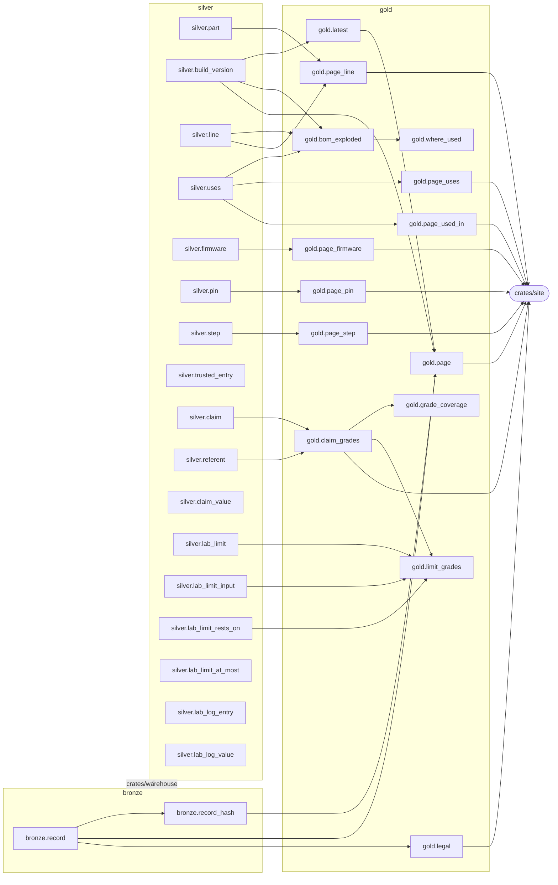

# Data catalogue

Every table and view in the warehouse, as DuckDB describes them, with the comments
`crates/warehouse/schema.sql` gives them. Generated by
`cargo run -p tentzhen-warehouse -- catalogue`; the test `the_catalogue_is_current` fails
when this file differs from what that would write. Change the schema, not this file.

## Lineage

`crates/warehouse` loads bronze and silver from the records. An arrow runs from what is
read to what reads it: a view's SQL, or a crate's source.

## bronze

### `bronze.record` (table)

Every file the loader read, exactly as read: records, drawings, site documents and the lab's limits.

| column | type | null | about |
|---|---|---|---|
| `path` | VARCHAR | no | The file's path, relative to the repo root. |
| `body` | VARCHAR | no |  |

Constraints:

- `PRIMARY KEY(path)`

Read by: `bronze.record_hash`, `gold.page`, `gold.legal`.

### `bronze.record_hash` (view)

Lineage: the sha256 of each file's text.

| column | type |
|---|---|
| `path` | VARCHAR |
| `sha256` | VARCHAR |

Reads: `bronze.record`.

Read by: `gold.page`.

## silver

### `silver.part` (table)

Each part record in parts/.

| column | type | null | about |
|---|---|---|---|
| `part` | VARCHAR | no |  |
| `kind` | VARCHAR | no |  |
| `what` | VARCHAR | no | The record's `is`: what the part is. |
| `authorized_only` | BOOLEAN | no |  |
| `datasheet` | VARCHAR | yes |  |
| `record` | VARCHAR | no | The file in bronze.record this row came from. |

Constraints:

- `PRIMARY KEY(part)`
- `CHECK((kind IN ('chip', 'module', 'product')))`

Read by: `gold.page_line`.

### `silver.build_version` (table)

Each version of each build, from builds/<build>/v<n>.toml.

| column | type | null | about |
|---|---|---|---|
| `build` | VARCHAR | no |  |
| `version` | INTEGER | no |  |
| `status` | VARCHAR | no |  |
| `does` | VARCHAR | no |  |
| `changes` | VARCHAR | yes |  |
| `drawing` | VARCHAR | yes |  |
| `record` | VARCHAR | no | The file in bronze.record this row came from. |

Constraints:

- `CHECK(("version" >= 1))`
- `CHECK((status IN ('draft', 'published')))`
- `PRIMARY KEY(build, "version")`
- `CHECK((("version" = 1) OR (changes IS NOT NULL)))`

Read by: `gold.latest`, `gold.bom_exploded`, `gold.page`.

### `silver.line` (table)

A build version's bill of materials: a part or a commodity on each line, and how many.

| column | type | null | about |
|---|---|---|---|
| `build` | VARCHAR | no |  |
| `version` | INTEGER | no |  |
| `line_no` | INTEGER | no |  |
| `part` | VARCHAR | yes |  |
| `commodity` | VARCHAR | yes |  |
| `form` | VARCHAR | yes |  |
| `qty` | INTEGER | no |  |

Constraints:

- `FOREIGN KEY (part) REFERENCES silver.part(part)`
- `CHECK((qty > 0))`
- `PRIMARY KEY(build, "version", line_no)`
- `FOREIGN KEY (build, "version") REFERENCES silver.build_version(build, "version")`
- `CHECK(((part IS NULL) != (commodity IS NULL)))`

Read by: `gold.bom_exploded`, `gold.page_line`.

### `silver.uses` (table)

Another build version a build version is made from, and how many.

| column | type | null | about |
|---|---|---|---|
| `build` | VARCHAR | no |  |
| `version` | INTEGER | no |  |
| `uses_no` | INTEGER | no |  |
| `uses_build` | VARCHAR | no |  |
| `uses_version` | INTEGER | no |  |
| `qty` | INTEGER | no |  |

Constraints:

- `CHECK((qty > 0))`
- `PRIMARY KEY(build, "version", uses_build, uses_version)`
- `FOREIGN KEY (build, "version") REFERENCES silver.build_version(build, "version")`
- `FOREIGN KEY (uses_build, uses_version) REFERENCES silver.build_version(build, "version")`

Read by: `gold.bom_exploded`, `gold.page_uses`, `gold.page_used_in`.

### `silver.firmware` (table)

The firmware a build version runs, pinned by its sha256.

| column | type | null | about |
|---|---|---|---|
| `build` | VARCHAR | no |  |
| `version` | INTEGER | no |  |
| `name` | VARCHAR | no |  |
| `license` | VARCHAR | no |  |
| `source` | VARCHAR | no |  |
| `release` | VARCHAR | no |  |
| `file` | VARCHAR | no |  |
| `sha256` | VARCHAR | no |  |
| `pin_map` | VARCHAR | yes |  |

Constraints:

- `CHECK(regexp_full_match(sha256, '[0-9a-f]{64}'))`
- `PRIMARY KEY(build, "version")`
- `FOREIGN KEY (build, "version") REFERENCES silver.build_version(build, "version")`

Read by: `gold.page_firmware`.

### `silver.pin` (table)

A build version's pin assignments.

| column | type | null | about |
|---|---|---|---|
| `build` | VARCHAR | no |  |
| `version` | INTEGER | no |  |
| `pin_no` | INTEGER | no |  |
| `name` | VARCHAR | no |  |
| `board_pin` | INTEGER | no |  |
| `net` | VARCHAR | no |  |
| `required` | BOOLEAN | no |  |

Constraints:

- `PRIMARY KEY(build, "version", pin_no)`
- `FOREIGN KEY (build, "version") REFERENCES silver.build_version(build, "version")`

Read by: `gold.page_pin`.

### `silver.step` (table)

A build version's steps, in order.

| column | type | null | about |
|---|---|---|---|
| `build` | VARCHAR | no |  |
| `version` | INTEGER | no |  |
| `step_no` | INTEGER | no |  |
| `instruction` | VARCHAR | no | The record's `do`. |
| `run` | VARCHAR | yes |  |
| `expect` | VARCHAR | yes |  |
| `agent` | VARCHAR | yes |  |

Constraints:

- `PRIMARY KEY(build, "version", step_no)`
- `FOREIGN KEY (build, "version") REFERENCES silver.build_version(build, "version")`

Read by: `gold.page_step`.

### `silver.trusted_entry` (table)

The trusted base, from trusted-base.toml: what is assumed, not shown. A trusted referent names an entry by its id.

| column | type | null | about |
|---|---|---|---|
| `entry` | VARCHAR | no | Its id. |
| `entry_no` | INTEGER | no | Its place in the file, from 1. |
| `assumes` | VARCHAR | no |  |
| `record` | VARCHAR | no | The file in bronze.record this row came from. |

Constraints:

- `PRIMARY KEY(entry)`

### `silver.claim` (table)

What a part or a build version claims. Its grades come from its referents, never typed.

| column | type | null | about |
|---|---|---|---|
| `claim` | VARCHAR | no | How it is cited: <part>#<id>, or <build>/v<n>#<id>. |
| `part` | VARCHAR | yes |  |
| `build` | VARCHAR | yes |  |
| `version` | INTEGER | yes |  |
| `claim_no` | INTEGER | no | Its place in its record, from 1. |
| `id` | VARCHAR | no |  |
| `says` | VARCHAR | no |  |

Constraints:

- `PRIMARY KEY(claim)`
- `FOREIGN KEY (part) REFERENCES silver.part(part)`
- `FOREIGN KEY (build, "version") REFERENCES silver.build_version(build, "version")`
- `CHECK(((part IS NULL) != (build IS NULL)))`
- `CHECK(((build IS NULL) = ("version" IS NULL)))`

Read by: `gold.claim_grades`.

### `silver.referent` (table)

What shows a claim: a proof, a bounded check or a test in simulation; a bench measurement record; or an entry in the trusted base.

| column | type | null | about |
|---|---|---|---|
| `claim` | VARCHAR | no |  |
| `kind` | VARCHAR | no |  |
| `evidence` | VARCHAR | yes | The proof, check, test or measurement record, as the claim names it. Nothing checks that it exists. |
| `trusted` | VARCHAR | yes | For a trusted referent, the entry in the trusted base that assumes the claim. |

Constraints:

- `FOREIGN KEY (claim) REFERENCES silver.claim(claim)`
- `CHECK((kind IN ('proof', 'check', 'test', 'record', 'trusted')))`
- `FOREIGN KEY ("trusted") REFERENCES silver.trusted_entry(entry)`
- `PRIMARY KEY(claim, kind)`
- `CHECK(((kind = 'trusted') = ("trusted" IS NOT NULL)))`
- `CHECK(((evidence IS NULL) = ("trusted" IS NOT NULL)))`

Read by: `gold.claim_grades`.

### `silver.claim_value` (table)

The numbers a claim states.

| column | type | null | about |
|---|---|---|---|
| `claim` | VARCHAR | no |  |
| `name` | VARCHAR | no | Ends in its unit: min_volts, input_ratio. |
| `amount` | DOUBLE | no |  |

Constraints:

- `FOREIGN KEY (claim) REFERENCES silver.claim(claim)`
- `PRIMARY KEY(claim, "name")`

### `silver.lab_limit` (table)

Each limit and its basis: a person's decision (policy), a copy of another value (same_as), or a rule in crates/lab (rule).

| column | type | null | about |
|---|---|---|---|
| `path` | VARCHAR | no | Where the value sits in the file, as table.key. |
| `amount` | DOUBLE | yes |  |
| `unit` | VARCHAR | yes |  |
| `choice` | VARCHAR | yes |  |
| `basis` | VARCHAR | no |  |
| `policy` | VARCHAR | yes |  |
| `rule` | VARCHAR | yes |  |
| `record` | VARCHAR | no | The file in bronze.record this row came from. |

Constraints:

- `PRIMARY KEY(path)`
- `CHECK((unit IN ('V', 'A')))`
- `CHECK((basis IN ('policy', 'same_as', 'rule')))`
- `CHECK(((amount IS NULL) = (unit IS NULL)))`
- `CHECK(((amount IS NULL) != (choice IS NULL)))`
- `CHECK(((basis = 'policy') = ("policy" IS NOT NULL)))`
- `CHECK(((basis = 'rule') = ("rule" IS NOT NULL)))`

Read by: `gold.limit_grades`.

### `silver.lab_limit_input` (table)

The values each limit comes from: the original it copies, or its rule's inputs.

| column | type | null | about |
|---|---|---|---|
| `path` | VARCHAR | no |  |
| `input` | VARCHAR | no |  |

Constraints:

- `FOREIGN KEY (path) REFERENCES silver.lab_limit(path)`
- `FOREIGN KEY ("input") REFERENCES silver.lab_limit(path)`
- `PRIMARY KEY(path, "input")`

Read by: `gold.limit_grades`.

### `silver.lab_limit_rests_on` (table)

The claims a limit relies on to do its job.

| column | type | null | about |
|---|---|---|---|
| `path` | VARCHAR | no |  |
| `claim` | VARCHAR | no |  |

Constraints:

- `FOREIGN KEY (path) REFERENCES silver.lab_limit(path)`
- `FOREIGN KEY (claim) REFERENCES silver.claim(claim)`
- `PRIMARY KEY(path, claim)`

Read by: `gold.limit_grades`.

### `silver.lab_limit_at_most` (table)

A number a limit may not exceed: a value of a claim it rests on. crates/lab holds the limit to it.

| column | type | null | about |
|---|---|---|---|
| `path` | VARCHAR | no |  |
| `claim` | VARCHAR | no |  |
| `name` | VARCHAR | no | The claim's value, in silver.claim_value. |

Constraints:

- `PRIMARY KEY(path)`
- `FOREIGN KEY (path) REFERENCES silver.lab_limit(path)`
- `FOREIGN KEY (path, claim) REFERENCES silver.lab_limit_rests_on(path, claim)`
- `FOREIGN KEY (claim, "name") REFERENCES silver.claim_value(claim, "name")`

### `silver.lab_log_entry` (table)

Each hardware action in the lab log, numbered in the log's order. Each entry names the sha256 of the line before it.

| column | type | null | about |
|---|---|---|---|
| `seq` | INTEGER | no | Its place in the log, from 1. |
| `logged_at` | TIMESTAMP | no | The entry's `at`, in UTC. |
| `by_kind` | VARCHAR | no | Who acted, from the entry's `by`: a person or an agent. |
| `by_name` | VARCHAR | no |  |
| `what` | VARCHAR | no | The action, such as supply.set. |
| `limits_sha256` | VARCHAR | no | The sha256 of lab/limits.toml as the host read it when the entry was written. Nothing checks that it names a version of that file. |
| `sha256` | VARCHAR | no | The sha256 of the entry's line, which the next entry names as its prev. |
| `prev` | VARCHAR | yes | The sha256 of the line before it; NULL only for the first entry. Unique, so the log cannot fork. |
| `record` | VARCHAR | no | The file in bronze.record this row came from. |

Constraints:

- `PRIMARY KEY(seq)`
- `CHECK((seq >= 1))`
- `CHECK((by_kind IN ('person', 'agent')))`
- `CHECK(regexp_full_match(limits_sha256, '[0-9a-f]{64}'))`
- `UNIQUE(sha256)`
- `CHECK(regexp_full_match(sha256, '[0-9a-f]{64}'))`
- `UNIQUE(prev)`
- `FOREIGN KEY (prev) REFERENCES silver.lab_log_entry(sha256)`
- `CHECK(((seq = 1) = (prev IS NULL)))`

### `silver.lab_log_value` (table)

What each action was asked to do (params) and what happened (result): each a number, a word or a yes/no.

| column | type | null | about |
|---|---|---|---|
| `seq` | INTEGER | no |  |
| `side` | VARCHAR | no |  |
| `name` | VARCHAR | no | A number's name ends in its unit: set_volts. |
| `amount` | DOUBLE | yes |  |
| `text` | VARCHAR | yes |  |
| `flag` | BOOLEAN | yes |  |

Constraints:

- `FOREIGN KEY (seq) REFERENCES silver.lab_log_entry(seq)`
- `CHECK((side IN ('params', 'result')))`
- `PRIMARY KEY(seq, side, "name")`
- `CHECK((((CAST((amount IS NOT NULL) AS INTEGER) + CAST(("text" IS NOT NULL) AS INTEGER)) + CAST((flag IS NOT NULL) AS INTEGER)) = 1))`

## gold

### `gold.latest` (view)

The newest version of each build.

| column | type |
|---|---|
| `build` | VARCHAR |
| `version` | INTEGER |

Reads: `silver.build_version`.

Read by: `gold.page`.

### `gold.claim_grades` (view)

Every claim on a part or a build version, with its grade on each axis: in simulation (proven, checked, tested) and on the bench (measured, trusted), each the strongest its referents give. No referent reads 'unknown'.

| column | type |
|---|---|
| `claim` | VARCHAR |
| `part` | VARCHAR |
| `build` | VARCHAR |
| `version` | INTEGER |
| `claim_no` | INTEGER |
| `id` | VARCHAR |
| `says` | VARCHAR |
| `sim_grade` | VARCHAR |
| `sim_evidence` | VARCHAR |
| `bench_grade` | VARCHAR |
| `bench_evidence` | VARCHAR |

Reads: `silver.claim`, `silver.referent`.

Read by: `gold.grade_coverage`, `gold.limit_grades`, `crates/site`.

### `gold.grade_coverage` (view)

How much of each part and build version is shown, and how.

| column | type |
|---|---|
| `subject` | VARCHAR |
| `claims` | BIGINT |
| `shown_in_sim` | BIGINT |
| `measured` | BIGINT |
| `trusted` | BIGINT |
| `unknown` | BIGINT |

Reads: `gold.claim_grades`.

Read by: no crate yet.

### `gold.bom_exploded` (view)

Every part and commodity a build version needs, through every build it uses, with quantities multiplied down the tree. The records forbid `uses` loops, so the recursion ends.

| column | type |
|---|---|
| `build` | VARCHAR |
| `version` | INTEGER |
| `part` | VARCHAR |
| `commodity` | VARCHAR |
| `form` | VARCHAR |
| `qty` | HUGEINT |

Reads: `silver.build_version`, `silver.line`, `silver.uses`.

Read by: `gold.where_used`.

### `gold.where_used` (view)

Where each part ends up, directly or inside another build.

| column | type |
|---|---|
| `part` | VARCHAR |
| `build` | VARCHAR |
| `version` | INTEGER |
| `qty` | HUGEINT |

Reads: `gold.bom_exploded`.

Read by: no crate yet.

### `gold.limit_grades` (view)

Each limit with the weakest bench grade (measured, trusted) among the claims it rests on, directly or through any value it comes from. NULL when it rests on no claim: nothing here claims it does its job.

| column | type |
|---|---|
| `path` | VARCHAR |
| `amount` | DOUBLE |
| `unit` | VARCHAR |
| `choice` | VARCHAR |
| `basis` | VARCHAR |
| `weakest_grade` | VARCHAR |
| `rests_on` | VARCHAR |

Reads: `gold.claim_grades`, `silver.lab_limit`, `silver.lab_limit_input`, `silver.lab_limit_rests_on`.

Read by: no crate yet.

### `gold.page` (view)

One row per build version, with its newest sibling, its drawing and the hash of its record.

| column | type |
|---|---|
| `build` | VARCHAR |
| `version` | INTEGER |
| `status` | VARCHAR |
| `does` | VARCHAR |
| `changes` | VARCHAR |
| `latest` | INTEGER |
| `latest_changes` | VARCHAR |
| `drawing_svg` | VARCHAR |
| `record` | VARCHAR |
| `record_sha256` | VARCHAR |

Reads: `bronze.record`, `bronze.record_hash`, `gold.latest`, `silver.build_version`.

Read by: `crates/site`.

### `gold.page_line` (view)

A build page's bill of materials, with each part's datasheet and whether it must come from an authorized distributor.

| column | type |
|---|---|
| `build` | VARCHAR |
| `version` | INTEGER |
| `line_no` | INTEGER |
| `qty` | INTEGER |
| `part` | VARCHAR |
| `commodity` | VARCHAR |
| `form` | VARCHAR |
| `datasheet` | VARCHAR |
| `authorized_only` | BOOLEAN |

Reads: `silver.line`, `silver.part`.

Read by: `crates/site`.

### `gold.page_uses` (view)

The build versions a build version is made from, for its page.

| column | type |
|---|---|
| `build` | VARCHAR |
| `version` | INTEGER |
| `uses_no` | INTEGER |
| `uses_build` | VARCHAR |
| `uses_version` | INTEGER |
| `qty` | INTEGER |

Reads: `silver.uses`.

Read by: `crates/site`.

### `gold.page_used_in` (view)

silver.uses read the other way: where each build version is used.

| column | type |
|---|---|
| `build` | VARCHAR |
| `version` | INTEGER |
| `in_build` | VARCHAR |
| `in_version` | INTEGER |
| `qty` | INTEGER |

Reads: `silver.uses`.

Read by: `crates/site`.

### `gold.page_firmware` (view)

silver.firmware, for build pages.

| column | type |
|---|---|
| `build` | VARCHAR |
| `version` | INTEGER |
| `name` | VARCHAR |
| `license` | VARCHAR |
| `source` | VARCHAR |
| `release` | VARCHAR |
| `file` | VARCHAR |
| `sha256` | VARCHAR |
| `pin_map` | VARCHAR |

Reads: `silver.firmware`.

Read by: `crates/site`.

### `gold.page_pin` (view)

silver.pin, for build pages.

| column | type |
|---|---|
| `build` | VARCHAR |
| `version` | INTEGER |
| `pin_no` | INTEGER |
| `name` | VARCHAR |
| `board_pin` | INTEGER |
| `net` | VARCHAR |
| `required` | BOOLEAN |

Reads: `silver.pin`.

Read by: `crates/site`.

### `gold.page_step` (view)

silver.step, for build pages.

| column | type |
|---|---|
| `build` | VARCHAR |
| `version` | INTEGER |
| `step_no` | INTEGER |
| `instruction` | VARCHAR |
| `run` | VARCHAR |
| `expect` | VARCHAR |
| `agent` | VARCHAR |

Reads: `silver.step`.

Read by: `crates/site`.

### `gold.legal` (view)

The disclaimer, as the site's legal page shows it.

| column | type |
|---|---|
| `body` | VARCHAR |

Reads: `bronze.record`.

Read by: `crates/site`.
